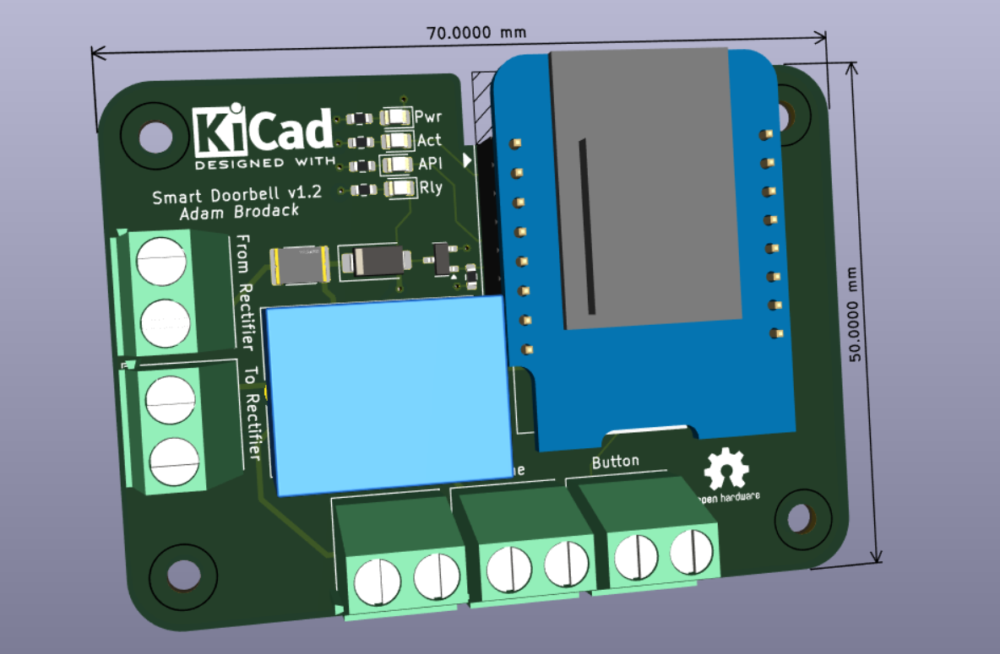
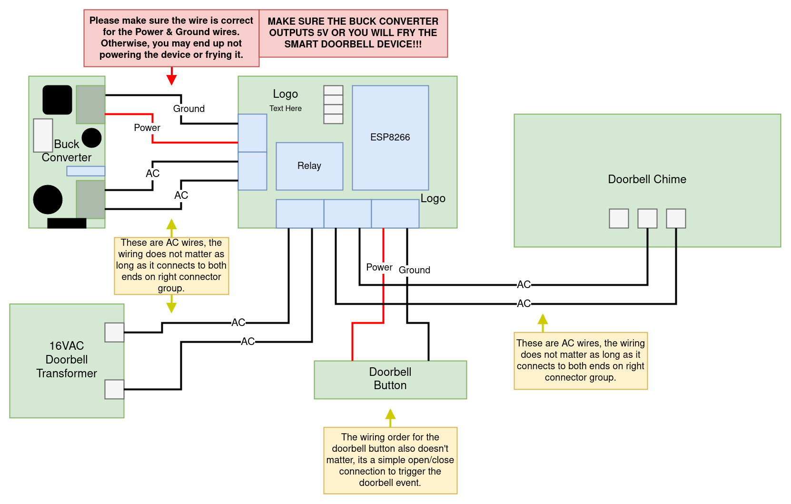

# Smart Doorbell

Kicad-designed smart doorbell PCB that provides the capability to use the existing doorbell transformer to power the board (via buck converter), use existing doorbell button wiring and controls the doorbell chime. The idea is to use the existing equipment and make it smarter (ability to detect the doorbell presses and send notification to Home Assistant while still triggering the doorbell chime).

This design has gone through its second revision to get a working version.

* **v1.0** - Wrong MOSFET chip, resulting in ESP8266 not having the ability to control the relay to trigger the doorbell chime.
* **v1.1** - Working version
* **v1.2** - Changed layout to simplify wire management between the buck converter and the doorbell hardware (transformer, chime & doorbell). This version was ordered through PCBWay (see below for more details).

## PCBWay Sponsorship

PCBWay has reached out to me this October 2024 to sponsor the manufacturing the **v1.2** revision. 

They have a pretty cool plugin for KiCad that generates the manufacturing files and sends it over to PCBWay's ordering page automatically. All I had to do is review the order options, modify any as needed, and add it to cart. The main part that's different from JLCPCB is that I didn't have to identify the part #s in the schematic file, they did it for me which is nice.

Although, it would be nice to have the option to define which ones to have the part #s identified for so they only have to reach out to me for confirmation on quote than asking me for part # on the non-assembled parts.

After a few weeks, the PCB boards were shipped to me from them. I am pretty satisfied with the manufacturing quality of them. One thing that's nice is that they give you a PCB board without any assembled parts along with 5 with the parts soldered on. May be useful for those who wants to see how it looks without the parts in the way for troubleshooting purposes. Was able to get other parts soldered on without any issues, just like the ones I usually get from JLCPCB.

You can check out their site for more details or to order one through them: https://www.pcbway.com/.

## Specifications

* Buck converter is required to power this board via 16VAC doorbell transformer ([Amazon Link](https://www.amazon.com/UMLIFE-Converter-2-5-35V-Regulator-Adjustable/dp/B094ZTG5S8)). **It needs to be adjusted to output 5v DC before connecting to this smart doorbell device.**
* 5v DC (output from DC for doorbell button) is used to power the doorbell instead of 16VAC from the transformer
* Uses ESPHome to handle the doorbell action like a traditional one, communicate updates to Home Assistant and to control the ESPHome-based smart bulbs to flash.
    * This is to allow the doorbell to function if Home Assistant is down.
    * The ESPHome YAML config can be found under `ESPHome/` folder.

## Doorbell Wire Diagram

Here's a diagram of how this smart doorbell interacts with a typical home's doorbell system with standard 16VAC transformer.

## Viewing Schematic & PCB Design

The designs can be seen using Kicanvas tool [here](https://kicanvas.org/?github=https%3A%2F%2Fgithub.com%2FAtomicbeast101%2Fsmart-doorbell) (this tool is still in alpha stage as of September 2024).
