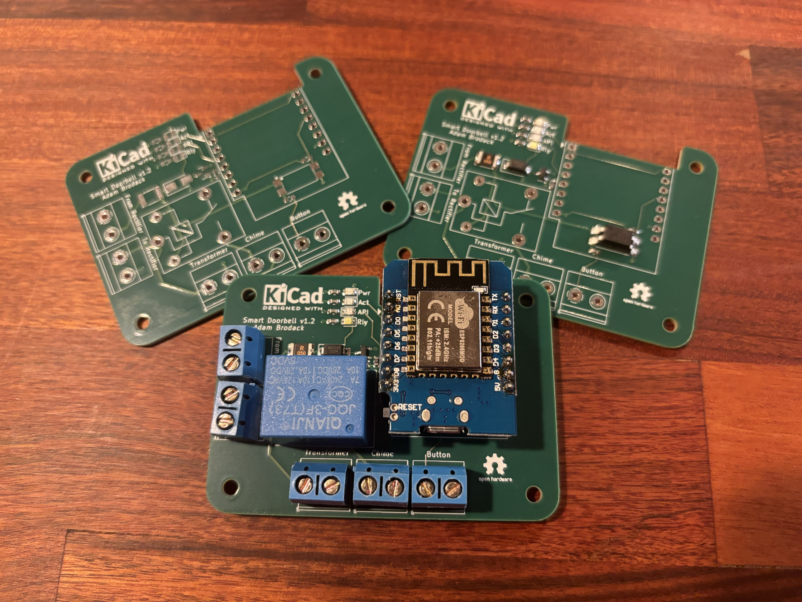

# Smart Doorbell

A KiCad-designed smart doorbell PCB that provides the capability to use the existing doorbell transformer to power the board (via a buck converter), utilize the existing doorbell button wiring, and control the doorbell chime. The idea is to leverage the existing equipment and make it smarter by enabling it to detect doorbell presses and send notifications to Home Assistant while still triggering the doorbell chime.

This design has gone through its second revision to achieve a working version. The third revision was done to improve the wiring layout, otherwise the schematic design is the same.

* **v1.0** - Wrong MOSFET chip, resulting in ESP8266 not having the ability to control the relay to trigger the doorbell chime.
* **v1.1** - Working version
* **v1.2** - Changed layout to simplify wire management between the buck converter and the doorbell hardware (transformer, chime & doorbell). This version was ordered through PCBWay (see below for more details).

## PCBWay Sponsorship

PCBWay reached out to me in October 2024 to sponsor the manufacturing of the **v1.2** revision.

They have a pretty cool plugin for KiCad that generates the manufacturing files and sends them directly to PCBWay's ordering page. All I had to do was review the order options, modify any as needed, and add it to my cart. The main difference from JLCPCB is that I didn't have to identify the part numbers in the schematic file; they did it for me, which is nice.

However, it would be beneficial to have the option to specify which part numbers should be identified, so they would only need to reach out to me for confirmation on the quote rather than asking me for part numbers on the non-assembled parts.

After a few weeks, the PCBs were shipped to me. I am quite satisfied with their manufacturing quality. One nice feature is that they provide one PCB without any assembled parts, along with five that have the components soldered on. This could be useful for those who want to see how it looks without the parts in the way for troubleshooting purposes. I was able to get other parts soldered on without any issues.

You can check out their site for more details or to place an order: https://www.pcbway.com/.

## Specifications

* Buck converter is required to power this board via 16VAC doorbell transformer ([Amazon Link](https://www.amazon.com/UMLIFE-Converter-2-5-35V-Regulator-Adjustable/dp/B094ZTG5S8)). **It needs to be adjusted to output 5v DC before connecting to this smart doorbell device.**
* 5v DC (output from DC for doorbell button) is used to power the doorbell instead of 16VAC from the transformer
* Uses ESPHome to handle the doorbell action like a traditional one, communicate updates to Home Assistant and to control the ESPHome-based smart bulbs to flash.
    * This is to allow the doorbell to function if Home Assistant is down.
    * The ESPHome YAML config can be found under `ESPHome/` folder.

## Doorbell Wire Diagram

Here's a diagram of how this smart doorbell interacts with a typical home's doorbell system with standard 16VAC transformer.

## Viewing Schematic & PCB Design

The designs can be seen using Kicanvas tool [here](https://kicanvas.org/?github=https%3A%2F%2Fgithub.com%2FAtomicbeast101%2Fsmart-doorbell) (this tool is still in alpha stage as of September 2024).
