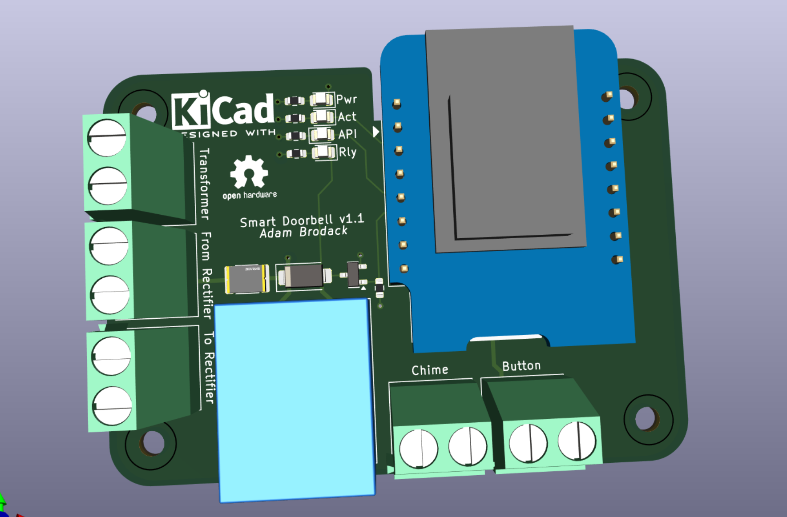
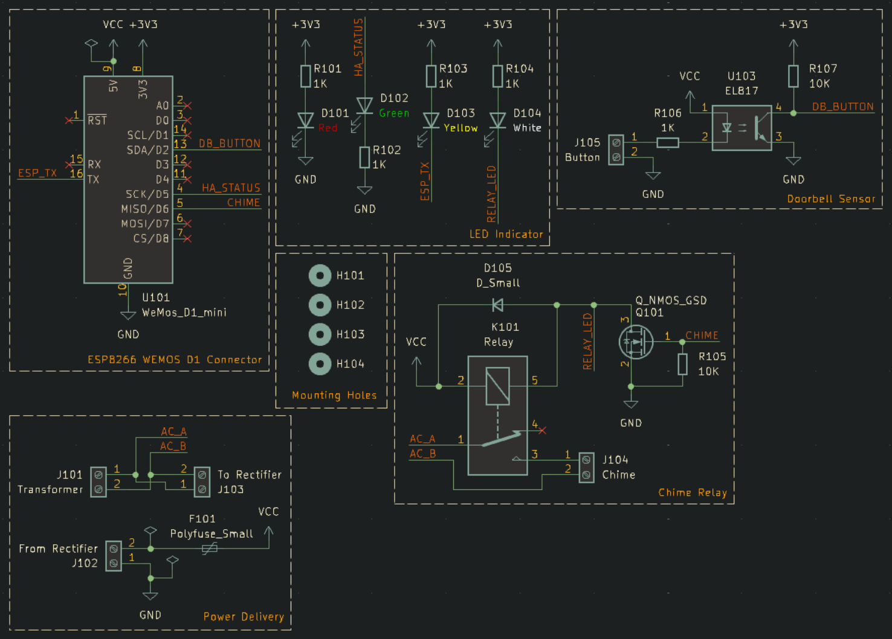

# Smart Doorbell

Kicad-designed smart doorbell PCB that provides the capability to use the existing doorbell transformer to power the board (via buck converter), use existing doorbell button wiring and controls the doorbell chime. The idea is to use the existing equipment and make it smarter (ability to detect the doorbell presses and send notification to Home Assistant while still triggering the doorbell chime).

This design has gone through its second revision and hoping it would be the final version (updated as of 8/25/2024).

## Specifications

* Buck converter is required to power this board via 16VAC doorbell transformer ([Amazon Link](https://www.amazon.com/UMLIFE-Converter-2-5-35V-Regulator-Adjustable/dp/B094ZTG5S8))
* 5V DC (output from DC for doorbell button) is used to power the doorbell instead of 16VAC from the transformer
* Uses ESPHome to handle the doorbell action like a traditional one, communicate updates to Home Assistant and to control the ESPHome-based smart bulbs to flash.
    * This is to allow the doorbell to function if HomeAssistant is down.

## Schematic

